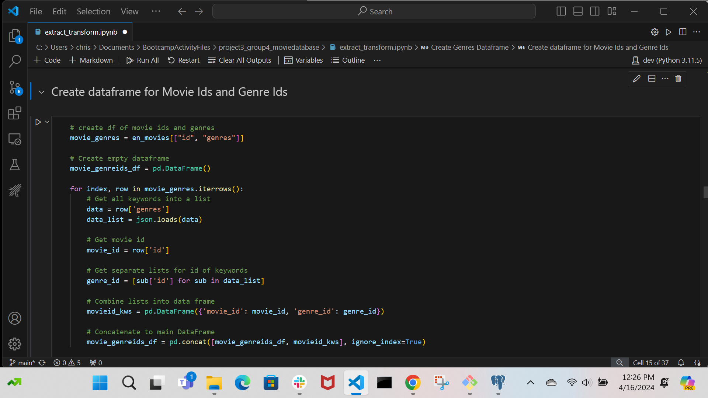
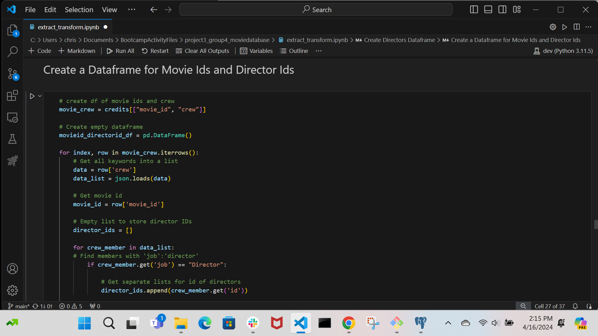

# Film Database ETL Project

>This project uses SQL Python Connector to allow users to query from the SQL database in Python.
>
>Python libraries not already present can be loaded via GitBash. Load required libraries and modules by running ‘pip install -r requirements.txt’
>
>Required Python Libraries and Modules:  
> - pyodbc  
> - pandas  
> - json  
> - itertools  
> - emoji  
>
> Pyodbc also requires installing a driver which can be found in this repository

## Project Goal - Film Recommendation Engine
Create a film recommendation engine to allow users to find films they might enjoy based on their preferences for the following:
- Director Name
- Actor Name
- Keyword
- Genre

The engine returns the top 10 films, in descending order of vote count, that contains the user input (i.e., director, actor, genre). 

This project focuses on the Extract, Transform, and Load processes rather than data visualization. As such, the user interface for the recommendation engine is a basic Python notebook that connects to PostgreSQL. 

The workflow diagram below gives a sequential overview of the steps taken to load and transform the data that would eventually become the .csv files (in red) used to create PostgreSQL tables.   

## Files

### Jupyter Notebooks
- extract_transform.ipynb: Jupyter notebook used to extract data from CSV files within the "Resources" folder
- odbc_query.ipynb: Jupyter notebook used to run a series of preset SQL queries using pyodbc
- odbc_user_input.ipynb: Jupyter notebook used to collect user inputs to use as parameters for SQL queries using pyodbc

### Folders
- csv_outputs: contains CSV files generated by the ETL process for importing into the SQL database
- graphics: contains other graphics used in this readme
- query outputs: saved queries used to test the functionality of the SQL database
- quick dbd: contains other files related to the quick dbd tool
- resources: contains source CSV files and the required ODBC driver for postgreSQL

## Extract Phase Goals  

### Some Ethical Considerations When Finding Data
Originally, the intent was to connect to a movie database API in order to collect real-time and current data. However, the OMDB film API's free API key only allowed for a user to perform 1000 queries per day. In order to get a sizable data set, our team would have needed to run thousands of queries as each film search is a single call. Our options were to either run our extraction code over several days or to create multiple accounts to collect a sufficient amount of data which we determined to be an abuse of a free open API key. Instead, we found a Kaggle dataset that a user retrieved from a TMDB movie API already loaded in a CSV file format containing 5000. Notably, the creator of the Kaggle data source originally used IMDB's API but had switched to TMDB's API instead as their publishing of the dataset using IMDB had been found to violate IMDB's usage policy. These issues highlight the responsibility of a data engineer to follow policies of an API's publisher.

### Extraction Steps
The goal of the extract phase was to allow the team to get familiar with the content and structure of each of the two data files, and from there identify which fields we would need to create database tables necessary for the recommendation engine.   
We could see from the files that we were working with lists of dictionaries in both cases.

Single record from tmdb_5000_movies.csv file containing information on each film:  
>budget,genres,homepage,id,keywords,original_language,original_title,overview,popularity,production_companies,production_countries,release_date,revenue,runtime,spoken_languages,status,tagline,title,vote_average,vote_count
>237000000,"[{""id"": 28, ""name"": ""Action""}, {""id"": 12, ""name"": ""Adventure""}, {""id"": 14, ""name"": ""Fantasy""}, {""id"": 878, ""name"": ""Science Fiction""}]",http://www.avatarmovie.com/,19995,"[{""id"": 1463, ""name"": ""culture clash""}, {""id"": 2964, >""name"": ""future""}, {""id"": 3386, ""name"": ""space war""}, {""id"": 3388, ""name"": ""space colony""}, {""id"": 3679, ""name"": ""society""}, {""id"": 3801, ""name"": ""space travel""}, {""id"": 9685, ""name"": ""futuristic""}, {""id"": 9840, ""name"": >""romance""}, {""id"": 9882, ""name"": ""space""}, {""id"": 9951, ""name"": ""alien""}, {""id"": 10148, ""name"": ""tribe""}, {""id"": 10158, ""name"": ""alien planet""}, {""id"": 10987, ""name"": ""cgi""}, {""id"": 11399, ""name"": ""marine""}, {""id"": 13065, >""name"": ""soldier""}, {""id"": 14643, ""name"": ""battle""}, {""id"": 14720, ""name"": ""love affair""}, {""id"": 165431, ""name"": ""anti war""}, {""id"": 193554, ""name"": ""power relations""}, {""id"": 206690, ""name"": ""mind and soul""}, {""id"": 209714, >""name"": ""3d""}]",en,Avatar,"In the 22nd century, a paraplegic Marine is dispatched to the moon Pandora on a unique mission, but becomes torn between following orders and protecting an alien civilization.",150.437577,"[{""name"": ""Ingenious Film Partners"", ""id"": >289}, {""name"": ""Twentieth Century Fox Film Corporation"", ""id"": 306}, {""name"": ""Dune Entertainment"", ""id"": 444}, {""name"": ""Lightstorm Entertainment"", ""id"": 574}]","[{""iso_3166_1"": ""US"", ""name"": ""United States of America""}, {""iso_3166_1"": >""GB"", ""name"": ""United Kingdom""}]",2009-12-10,2787965087,162,"[{""iso_639_1"": ""en"", ""name"": ""English""}, {""iso_639_1"": ""es"", ""name"": ""Espa\u00f1ol""}]",Released,Enter the World of Pandora.,Avatar,7.2,11800  

Single record (abbreviated) from tmdb_5000_credits.csv file about cast and crew:  
>movie_id,title,cast,crew,19995, Avatar,"[{""cast_id"": 242, ""character"": ""Jake Sully"", ""credit_id"": ""5602a8a7c3a3685532001c9a"", ""gender"": 2, ""id"": 65731, ""name"": ""Sam Worthington"", ""order"": 0}, {""cast_id"": 3, ""character"": ""Neytiri"", >""credit_id"": ""52fe48009251416c750ac9cb"", ""gender"": 1, ""id"": 8691, ""name"": ""Zoe Saldana"", ""order"": 1}, {""cast_id"": 25, ""character"": ""Dr. Grace Augustine"", ""credit_id"": ""52fe48009251416c750aca39"", ""gender"": 1, ""id"": 10205, ""name"": >""Sigourney Weaver"", ""order"": 2}, {""cast_id"": 4, ""character"": ""Col. Quaritch"", ""credit_id"": ""52fe48009251416c750ac9cf"", ""gender"": 2, ""id"": 32747, ""name"": ""Stephen Lang"", ""order"": 3}, {""cast_id"": 5, ""character"": ""Trudy Chacon"", >""credit_id"": ""52fe48009251416c750ac9d3"", ""gender"": 1, ""id"": 17647, ""name"": ""Michelle Rodriguez"", ""order"": 4}, {""cast_id"": 8, ""character"": ""Selfridge"", ""credit_id"": ""52fe48009251416c750ac9e1"", ""gender"": 2, ""id"": 1771, ""name"": ""Giovanni >Ribisi"", ""order"": 5}, {""cast_id"": 7, ""character"": ""Norm Spellman"", ""credit_id"": ""52fe48009251416c750ac9dd"", ""gender"": 2, ""id"": 59231, ""name"": ""Joel David Moore"", ""order"": 6}, {""cast_id"": 9, ""character"": ""Moat"", ""credit_id"": >""52fe48009251416c750ac9e5"", ""gender"": 1, ""id"": 30485, ""name"": ""CCH Pounder"", ""order"": 7}, {""cast_id"": 11, ""character"": ""Eytukan"", ""credit_id"": ""52fe48009251416c750ac9ed"", ""gender"": 2, ""id"": 15853, ""name"": ""Wes Studi"", ""order"": 8}, >""cast_id"": 10, ""character"": ""Tsu'Tey"", ""credit_id"": ""52fe48009251416c750ac9e9"", ""gender"": 2, ""id"": 10964, ""name"": ""Laz Alonso"", ""order"": 9}, {""cast_id"": 12, ""character"": ""Dr. Max Patel"", ""credit_id"": ""52fe48009251416c750ac9f1"", >""gender"": 2, ""id"": 95697, ""name"": ""Dileep Rao"", ""order"": 10}, {""cast_id"": 13, ""character"": ""Lyle Wainfleet"", ""credit_id"": ""52fe48009251416c750ac9f5"", ""gender"": 2, ""id"": 98215, ""name"": ""Matt Gerald"", ""order"": 11}, {""cast_id"": 32, >""character"": ""Private Fike"", ""credit_id"": ""52fe48009251416c750aca5b"", ""gender"": 2, ""id"": 154153, ""name"": ""Sean Anthony Moran"", ""order"": 12}, {""cast_id"": 33, ""character"": ""Cryo Vault Med Tech"", ""credit_id"": ""52fe48009251416c750aca5f"", >""gender"": 2, ""id"": 397312, ""name"": ""Jason Whyte"", ""order"": 13}, {""cast_id"": 34, ""character"": ""Venture Star Crew Chief"", ""credit_id"": ""52fe48009251416c750aca63"", ""gender"": 2, ""id"": 42317, ""name"": ""Scott Lawrence"", ""order"": 14}, >{""cast_id"": 35, ""character"": ""Lock Up Trooper"", ""credit_id"": ""52fe48009251416c750aca67"", ""gender"": 2, ""id"": 986734, ""name"": ""Kelly Kilgour"", ""order"": 15}, {""cast_id"": 36, ""character"": ""Shuttle Pilot"", ""credit_id"": ""52fe48009251416c750aca6b"", ""gender"": 0, ""id"": 1207227, ""name"": ""James Patrick Pitt"", ""order"": 16}, {""cast_id"": 37, ""character"": ""Shuttle Co-Pilot"", ""credit_id"": ""52fe48009251416c750aca6f"", ""gender"": 0, ""id"": 1180936, ""name"": ""Sean Patrick Murphy"", ""order"": 17}, {""cast_id"": 38, ""character"": ""Shuttle Crew Chief"", ""credit_id"": ""52fe48009251416c750aca73"", ""gender"": 2, ""id"": 1019578, ""name"": ""Peter Dillon"", ""order"": 18}, {""cast_id"": 39, ""character"": ""Tractor Operator / Troupe"", >""credit_id"": ""52fe48009251416c750aca77"", ""gender"": 0, ""id"": 91443, ""name"": ""Kevin Dorman"", ""order"": 19}, {""cast_id"": 40, ""character"": ""Dragon Gunship Pilot"", ""credit_id"": ""52fe48009251416c750aca7b"", ""gender"": 2, ""id"": 173391, ""name"": >""Kelson Henderson"", ""order"": 20}, {""cast_id"": 41, ""character"": ""Dragon Gunship Gunner"", ""credit_id"": ""52fe48009251416c750aca7f"", ""gender"": 0, ""id"": 1207236, ""name"": ""David Van Horn"", ""order"": 21}, {""cast_id"": 42, ""character"": ""Dragon >Gunship Navigator"", ""credit_id"": ""52fe48009251416c750aca83"", ""gender"": 0, ""id"": 215913, ""name"": ""Jacob Tomuri"", ""order"": 22}, {""cast_id"": 43, ""character"": ""Suit #1"", ""credit_id"": ""52fe48009251416c750aca87"", ""gender"": 0, ""id"": 143206, >""name"": ""Michael Blain-Rozgay"", ""order"": 23}, {""cast_id"": 44, ""character"": ""Suit #2"", ""credit_id"": ""52fe48009251416c750aca8b"", ""gender"": 2, ""id"": 169676, ""name"": ""Jon Curry"", ""order"": 24}, {""cast_id"": 46, ""character"": ""Ambient Room >Tech"", ""credit_id"": ""52fe48009251416c750aca8f"", ""gender"": 0, ""id"": 1048610, ""name"": ""Luke Hawker"", ""order"": 25}, {""cast_id"": 47,...   

We read into VS Code the two .csv files as data frames ‘movies’ and ‘credits.’  

We first read the tmdb_5000_movies.csv file containing information on each film. We then filtered for English-language movies only, as the characters in some foreign-language film titles were not translated.   

Next, we read in the tmdb_5000_credits.csv containing information about each film’s cast and crew.   
We filtered this second file for the cast and crew corresponding to only the English-language films that we kept from the first file.  

## Transform Phase Goals  
The goal of the transform phase was to parse the imported data in ways that would allow us to create a series of data frames we’d export as .csv files to import into the tables of our SQL database. We will be using a SQL database as there are many items for each film that contain multiple entries such as genre and actor. The schema below indicates the relationships we’d establish between our nine tables.   

The first data frame we created was the ‘genres_df’ data frame. First, we defined ‘ids_names’ as an empty set for the genre ids and names found in The Movie Database. We filled this set list by looping through the ‘genres’ column of the ‘en_movies’ data frame (English-language films), isolating ‘id’ and ‘name’ from each row. We used the json.loads(row) method to parse the JSON string of ’id’ and ‘name’ data into a Python dictionary. This enabled us to access the data as key-value pairs, with ‘id’ and ‘name’ containing the genre id and the genre name.  Next, we converted the IDs from strings to integers.

To add in the emojis for each ‘genre’ value, we defined our own dictionary of emojis, ‘emoji_dict’.
From the items in the ‘emoji_dic’ we created an ‘emoji_df’ dataframe that also included the genres’ ‘alias’. By doing a left merge on ‘emoji_genres’ and ‘emoji_df’ on the column ‘genre’, we populated the ‘emoji_genres’ dataframe. Then we used list comprehension to apply the emoji.emojize() function to each emoji alias value and generate the emoji character from the alias language. Finally, we exported the ‘emoji_genres’ dataframe as a .csv file called 'emoji_genres.csv'

When it came to creating a data frame .csv file for the ‘actors’, we restricted our consideration of characters (actors) to only the first five listed per film. We filtered the ‘credits’ data frame for the first five cast members present per movie within the ‘cast’ field.  Along with each uniquely-identified movie_id, we saved each ‘cast’ dictionary (‘cast_id’ and ‘character’) embedded within the ‘cast’ field of the credits dataframe. The result was a data frame containing five instances of the movie_id, one for each of the first five cast members credited in the film. 

The example below shows a test for the first five actor ids and names associated with the movie Avatar, the first film in the ‘credits’ dataframe. The subsequent screenshots illustrate how we performed this process on the entire dataset.   

We used the itterows method in pandas to iterate over the rows of the ‘cast’ data frame. We did this to split out the actor names from each movie title into a list. We used a similar process to isolate the ‘movie_id’ values. In order to capture the unique actor ids (as any actor could appear multiple times in the data set for being in multiple movies) we initialized an empty set and an empty list.   

By using a for loop and and several if statements, we iterated through the cast data to get only one instance of each actor name and actor id that appeared in the data set. We instructed the loop to stop working once our  number of unique actors per film reached 5.    

We next created separate lists for ‘actor_id’ and ‘actor_name’ and created the ‘five_df’ data frame to hold ‘movie_id’, ‘actor_id’, and ‘actor_name’. Then we concatenated the data frame to contain the ‘actor_id’ as transformed from string to integer, the ‘movie_id’, and the actor ‘name’ as a new data frame called ‘credits_actor_name’.  

In creating a ‘credits_actor_df’ data frame by dropping actor ‘name’ from ‘credits_actor_name’, we produced the data needed to ultimately produce our future ‘credit_actor’ table needed to link our ‘actor’ and ‘movies’ table in the SQL database. We exported the ‘credits_actor_df’ data frame as a .csv for later use.   

In order to create an ‘actor’ dataframe, .csv file, and database table of ‘actor_id’ and ‘actor_name’, we defined ‘ids_cast’ as a set to hold unique pairs of ‘actor_id” and actor ’name’.  Next, we iterated through the ‘credits_actor_name’ data frame using the iterrows() method. This allowed us to extract‘actor_id’ and actor ‘name’ from the rows and place them in the ‘ids_cast’ set. By using the itertools.islice() method on the ‘ids_cast’ set, we could print out the first 10 ‘actor_id’ and ‘actor_name’ pairs to the terminal.   

To identify each movie’s director, we had to first extract the ‘crew’ and the ‘movie_id’ information from the credits data file.  We saved this extracted data in a data frame called ‘movie_crew’. Next, we used the .iterrows(); method to iterate through ‘movie_crew’ and load the data found in the ‘crew’ row as a Python list to ‘data_list’. Similarly, we used .iterrows() to isolate the ‘movie_id’ value from the ‘movie_id’ row.   

Within the ‘data_list’ we had to identify crew_members that had a ‘job’ value equal to “Director.” We accomplished this by using a for loop on the ‘data_list’. Then we used .get() to append each Director’s ‘id’ to an empty list we called ‘director_ids’.   

Creating a new dataframe called ‘movie_director’ allowed us to associate a list of ‘movie_id’s with their related ‘director_id’, allowing for the possibility that multiple directors may be credited per movie. We then concatenated our empty dataframe ‘movieid_directorid_df with ‘movie_director’ and converted movie and director id fields to integers with .astype(). Finally, we exported ‘movieid_directorid_df’ to a .csv file for later use in SQL database table creation.   

To link our ‘directors’ table to our ‘movies’ table in the eventual SQL database, we needed to build a table containing ‘director_id’ and ‘movie_id’. Again, we looked at the credits datafile for ‘movie_id’ and ‘crew’. Like in the previous step, we used iterrows(): to isolate ‘crew’ and ‘movie_id’ and identify instances where ‘job’ equals “Director” using .get(), so that we could append all (director) ‘id’ values to an empty list called ‘director_ids’.  We then used this list to create the ‘movie_director’ data frame to pair ‘movie_id’s with associated ‘director_id’s.    

Again, we concatenated an initialized data frame ‘movieid_directorid_df’ with the ‘movie_director’ data frame before converting ‘movie_id’s and ‘director_id’s to integers with astype(int). Finally, we exported ‘movieid_directorid_df’ to a .csv file.   

To allow users of our movie recommendation engine to search for films based on keywords, we decided to include in our SQL database a ‘keywords’ field from the ‘en_movies’ dataset we’d created from the original ‘movies’ and ‘crew’ data files. 

The for loop-json.loads() process once again helped us isolate (keyword) ‘id’ and (keyword) ‘name’ from the source data and update them to the ‘ids_keyword’ set we defined. Again, we exported the resulting data frame, ‘keywords_df’ to a .csv file for import into our SQL database. 

With a query-by-keywords function for our movie recommendation engine, we needed a data frame, .csv file, database table that linked keywords with movie ids. We created this link using a similar process we used in creating the other linking data frames/.csv files/tables. The script is shown below.

The final dataframe-to .csv-to table we needed to create is for ‘movies’. First, we selected the columns we wanted from our ‘en_movies’ data set and assigned them to a dictionary, ‘data’. From the ‘data’ we made a data frame. Within that data frame, we converted all ‘movie_id’ values from string to integer type using .astype(int) and converted ‘release_date’ values from string to datetime type using the pd.to_datetime method. We also assigned null values to the ‘tagline’ and ‘release_date’ columns that were missing data. Finally, we exported ‘movies_df’ to a .csv file for further use. 

## Load Phase Goals

The goal of the Load Phase was to successfully import all 9 .csv files, create the tables into which we'd import the .csv files, and create the required table joins needed to demonstrate the movie recommendation engine. To create an interactive experience with the SQL database, the team also produced a simple but easy-to-use user interface with SQL Python Connector. This allows users to query from the SQL database in Python.

We used the following query to create the tables we’d designed for the SQL database. 

-- Exported from QuickDBD: https://www.quickdatabasediagrams.com/  
-- Link to schema: https://app.quickdatabasediagrams.com/#/d/Hftcv0  
-- NOTE! If you have used non-SQL datatypes in your design, you will have to change these here.  

-- Exported from QuickDBD: https://www.quickdatabasediagrams.com/  
-- Link to schema: https://app.quickdatabasediagrams.com/  
-- NOTE! If you have used non-SQL datatypes in your design, you will have to change these here.  

CREATE TABLE "movies" (
    "movie_id" int   NOT NULL,
    "title" varchar(100)   NOT NULL,
    "revenue" bigint   NOT NULL,
    "tagline" varchar(300)   NOT NULL,
    "average_vote" numeric(5,1)   NOT NULL,
    "popularity" decimal(9,6)   NOT NULL,
    "release_date" date   NOT NULL,
    CONSTRAINT "pk_movies" PRIMARY KEY (
        "movie_id"
     )
);

CREATE TABLE "actor" (
    "actor_id" int   NOT NULL,
    "actor" varchar(50)   NOT NULL,
    CONSTRAINT "pk_actor" PRIMARY KEY (
        "actor_id"
     )
);

CREATE TABLE "credits_actor" (
    "movie_id" int   NOT NULL,
    "actor_id" int   NOT NULL
);

CREATE TABLE "directors" (
    "director_id" int   NOT NULL,
    "director" varchar(100)   NOT NULL,
    CONSTRAINT "pk_directors" PRIMARY KEY (

   "director_id"
     )
);

CREATE TABLE "movieid_director_id" (
    "movie_id" int   NOT NULL,
    "director_id" int   NOT NULL
);

CREATE TABLE "emoji_genre" (
    "genre_id" int   NOT NULL,
    "genre" varchar(100)   NOT NULL,
    "alias" varchar(100)   NOT NULL,
    "genre_emoji" varchar(100)   NOT NULL,
    CONSTRAINT "pk_emoji_genre" PRIMARY KEY (
        "genre_id"
     )
);

CREATE TABLE "movieid_genre_ids" (
    "movie_id" int   NOT NULL,
    "genre_id" int   NOT NULL
);

CREATE TABLE "keywords" (
    "keyword_id" int   NOT NULL,
    "keyword" varchar(50)   NOT NULL,
    CONSTRAINT "pk_keywords" PRIMARY KEY (
        "keyword_id"
     )
);

CREATE TABLE "movieids_kw" (
    "movie_id" int   NOT NULL,
    "keyword_id" int   NOT NULL
);

ALTER TABLE "credits_actor" ADD CONSTRAINT "fk_credits_actor_movie_id" FOREIGN KEY("movie_id")
REFERENCES "movies" ("movie_id");

ALTER TABLE "credits_actor" ADD CONSTRAINT "fk_credits_actor_actor_id" FOREIGN KEY("actor_id")
REFERENCES "actor" ("actor_id");

ALTER TABLE "movieid_director_id" ADD CONSTRAINT "fk_movieid_director_id_movie_id" FOREIGN KEY("movie_id")
REFERENCES "movies" ("movie_id");

ALTER TABLE "movieid_director_id" ADD CONSTRAINT "fk_movieid_director_id_director_id" FOREIGN KEY("director_id")
REFERENCES "directors" ("director_id");

ALTER TABLE "movieid_genre_ids" ADD CONSTRAINT "fk_movieid_genre_ids_movie_id" FOREIGN KEY("movie_id")
REFERENCES "movies" ("movie_id");

ALTER TABLE "movieid_genre_ids" ADD CONSTRAINT "fk_movieid_genre_ids_genre_id" FOREIGN KEY("genre_id")
REFERENCES "emoji_genre" ("genre_id");

ALTER TABLE "movieids_kw" ADD CONSTRAINT "fk_movieids_kw_movie_id" FOREIGN KEY("movie_id")
REFERENCES "movies" ("movie_id");

ALTER TABLE "movieids_kw" ADD CONSTRAINT "fk_movieids_kw_keyword_id" FOREIGN KEY("keyword_id")
REFERENCES "keywords" ("keyword_id");

Import Files into Tables, in this order:
1. actor  
2. directors  
3. emoji_genre  
4. keywords  
5. movies  
6. credits_actor  
7. movieid_director_id  
8. movieid_genre_ids  
9. movieids_kw 

## Running the movie recommendation engine
Steps to interact with the movie recommendation engine:
1. (If necessary) Go to the Resources folder and locate the psqlodbc_16_00_0000-x64 folder. Within the folder is an installer file called psqlodbc_x64. Run the installer. 
2. Open up VS Code and the folder containing the obdc_user_input.ipynb files. 
3. Run the first two blocks of code to import pyodbc and pandas, and connect to the Postgres SQL database.
4. Run the Actor, Genre, Director, Keyword, and Keyword (LIKE) blocks one by one.
   

Below is a short video showing the finished Movie Recommendation Engine we created:

https://github.com/mcjauregui72/FilmDatabase/User_Input_Demo.mp4

## Future Improvements

The first main improvement possible for this project is to retrieve data from a live API instead of a Kaggle dataset. Using a paid API key makes it possible to build a more repeatable Python script to periodically query the API and update our SQL database to keep it up to date with new films. Another improvement could be with the movie recommendation engine by building a standalone application that leverages ODBC or another database data retrieval method to give a list of film results in the form of a CSV or visualization tool such as Power BI. However, our team felt that this went beyond the scope of our project and built a Jupyter notebook to take user inputs and use it to run SQL queries. The queries we put together were fairly simple and only took a single entry in a single field for actor, director, genre, or keyword. There is more room for performing multiple queries and to use other film information to query for data.

## Sources:  

Kaggle source  
https://www.kaggle.com/datasets/tmdb/tmdb-movie-metadata/data?select=tmdb_5000_movies.csv  

TMDB   
https://developer.themoviedb.org/docs/getting-started  

For json.loads info  
https://www.geeksforgeeks.org/json-loads-in-python/  

For info on sets  
https://realpython.com/python-sets/  

For emoji library  
https://emoji-python.readthedocs.io/en/stable/  

For itertools:  
https://docs.python.org/3/library/itertools.html  

For String Aggregate  
https://www.postgresqltutorial.com/postgresql-aggregate-functions/postgresql-string_agg-function/  

Pyodbc:  
https://pypi.org/project/pyodbc/

For User Inputs with pyodbc:  
https://stackoverflow.com/questions/9518148/pyodbc-how-to-perform-a-select-statement-using-a-variable-for-a-parameter

